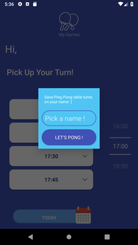
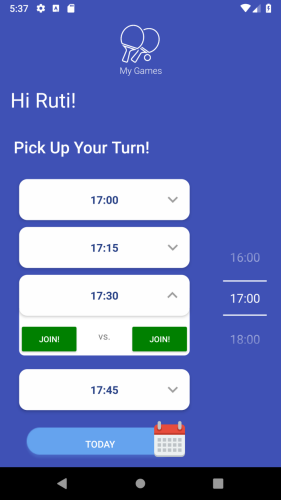

### MyPingPongTable

## Description
- MyPingPongTable allows you to reserve games with friends or strangers.
- No need to wait near the ping pong table while others are playing, 
  so you won't miss your turn - just reserve in advance and play!
- The app allows you to reserve games for anytime in the future.

## Installation
- Clone this repository and open the project with AndroidStudio.
- Run `app` on your android phone / emulator 
(`Pixel XL` -> `x86 Images` -> `Pie 28 Android 9.0 (Google APIs)`).

## Usage
- Enter your user name.
- Schedule your next game right away!

## Feature requests - 
1. Disable myturn button if no games - Carmel Done
2. Validations on the new user name - Ran Done
3. Add current turn to Google Calender - Shani Done 

## Notes for open-source contributers:
See project board for new features to work on 
https://github.com/RanHadar/MyPingPongTable/projects/1

